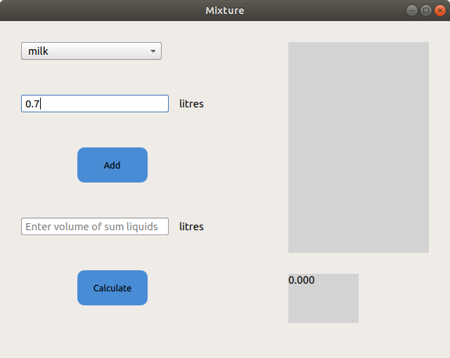
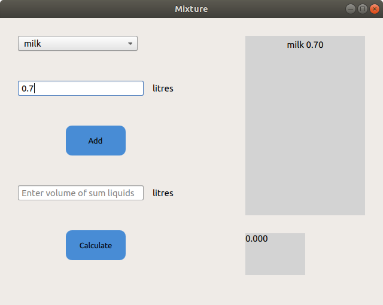
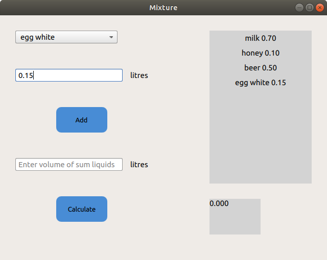
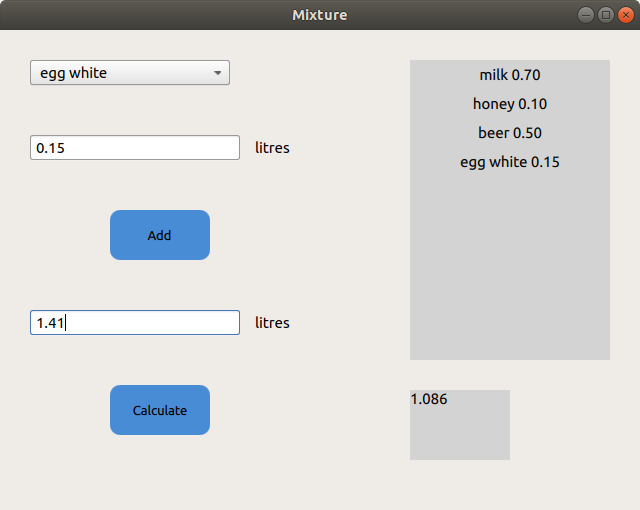
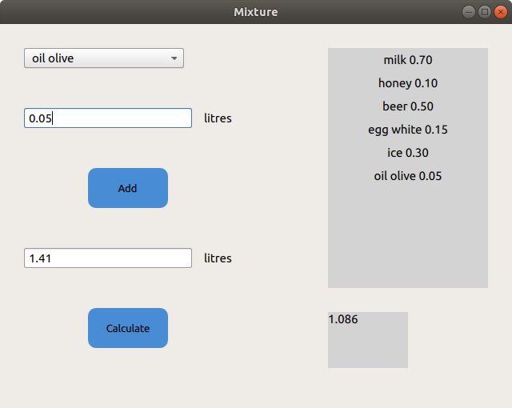
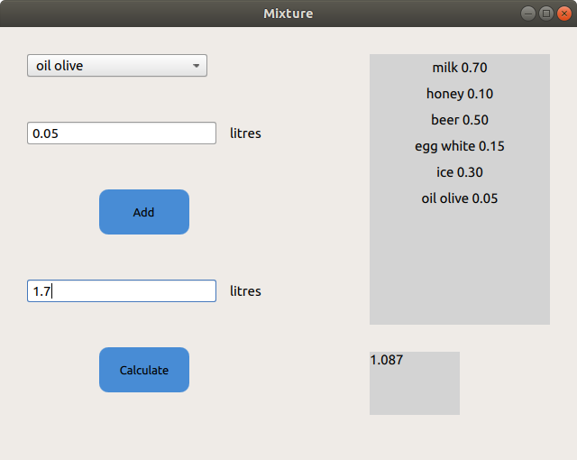

# LiquidMixture
Приложение считает плотность смеси жидкостей.
Смешиваемые жидкости можно выбирать из предложенных вариантов в выпадающем списке. Выбрав жидкость, нужно вести ее
объем в литрах в поле Enter volume of liquid.

Затем нажать кнопку Add. Выбранная жидкость и ее объем появятся в поле справа.

Таким образом можно добавить несколько жидкостей. Весь список с указанным объемом каждой будет отображаться в поле справа.

Затем нужно ввести объем получившейся смеси в литрах, в соответствующем поле Enter volume of um liquids. После чего нажать кнопку
Calculate.
Результат появится в поле в правом нижнем углу.

После подсчета можно добавить еще несколько жидкостей для смешивания. Они также отобразятся в поле справа.

После этого нужно будет ввести новый суммарный объем и нажать кнопку Calculate. Новая рассчитанная плотность появится в поле в
правом нинем углу.

